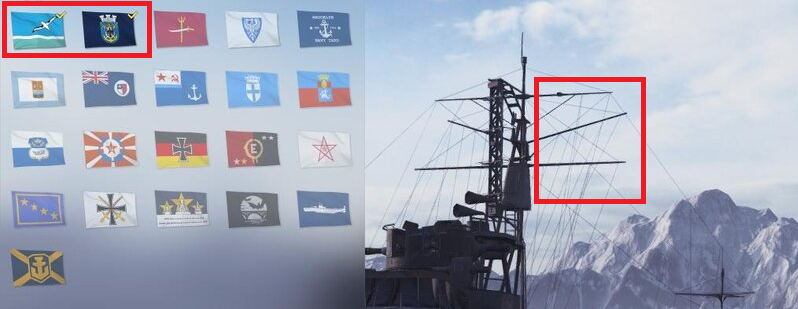

# noflags

A modification of the World of Warships game to hide flags.



# Install

- Download .zip archive from the [Releases page](https://github.com/qMBQx8GH/noflags/releases).
- Open the folder with the game, find the bin folder in it and go to it.
- It will contain folders with numerical names - these are versions of the game.
- As a rule, the actual version is the largest number.
- Go to it and open the res_mods folder with it.
- It should look something like D:\Games\World_of_Warships\bin\6775398\res_mods
- Here in this folder and unpack the archive (if you are prompted to replace the files, then agree).

# Build yourself

1. Install python 3.X, git
1. Clone the repository
```git clone https://github.com/qMBQx8GH/noflags```
1. Change directory to noflags
```cd noflags```
1. Install required packages
```python -m pip install -r requirements.txt```
1. Copy and edit build.ini.dist
```cp build.ini.dist build.ini```
1. Create an archive to unpack into bin\NNNNNNNN\res_mods folder in the game.
```python game_update.py build.ini```
