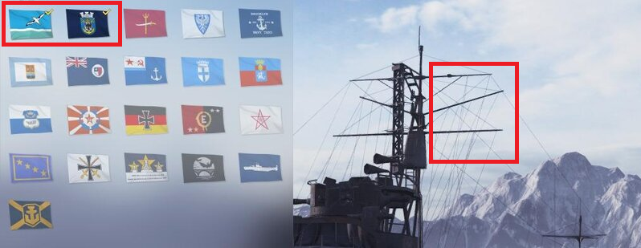

# noflags

Модификация игры "Мир кораблей" для скрытия флагов.




# Установка

- Скачайте .mkmod файл со [страницы релизов](https://wows.mv-smirnov.org/ru/noflags/).
- Откройте папку с игрой, найдите в ней папку bin и перейдите в нее.
- В ней будут содержаться папки с числовыми названиями - это версии игры.
- Как правило, актуальная версия - это наибольшее число.
- Перейдите в нее и откройте папку mods.
- Она должна выглядеть примерно так: D:\Games\Korabli\bin\6775398\mods
- В эту папку скопируйте ранее скачанный файл.


# Сделать самому

1. Установите 3.X, git
1. Склонируйте репозиторий
```git clone https://github.com/qMBQx8GH/noflags```
1. Смените директорию на noflags
```cd noflags```
1. Переключитесь на ветку mk
```git checkout mk```
1. Установите требуемые пакеты python
```python -m pip install -r requirements.txt```
1. Скопируйте и отредактируйте build.ini.dist
```cp build.ini.dist build.ini```
1. Собрать архив с модом. Он будет создан в каталоге dist
```python game_update.py build.ini```
